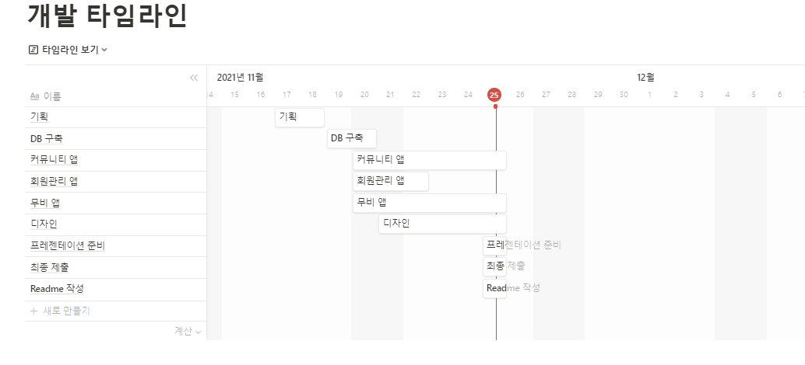
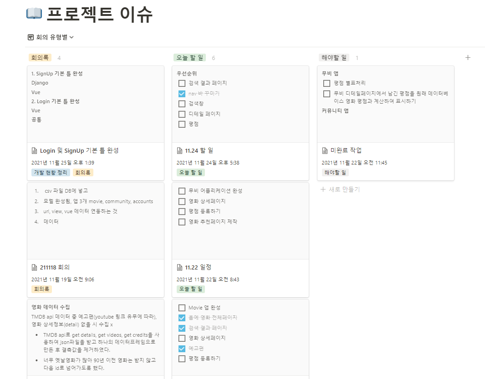
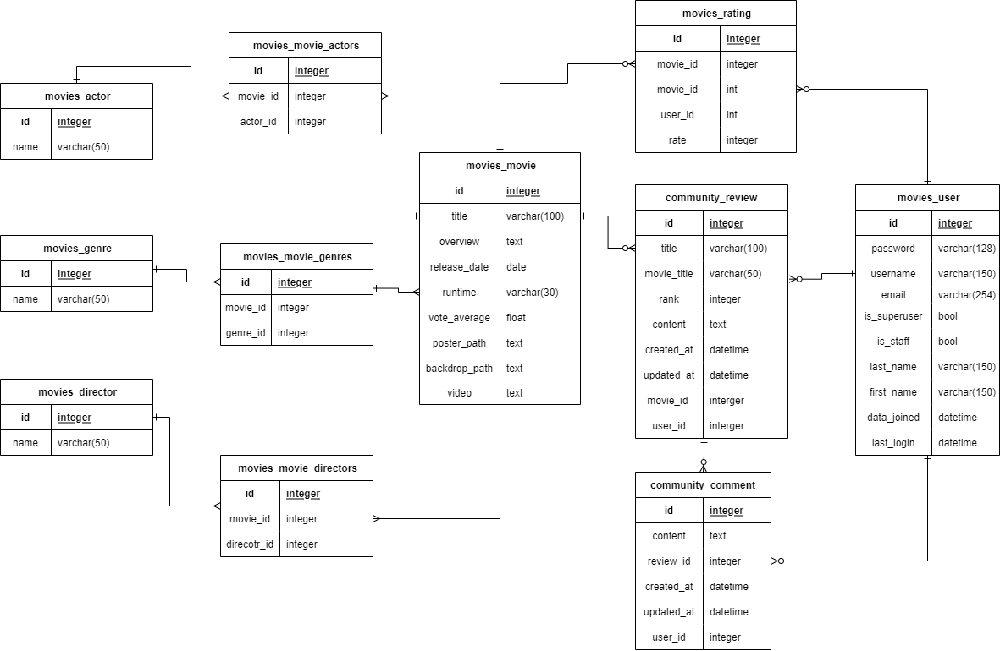
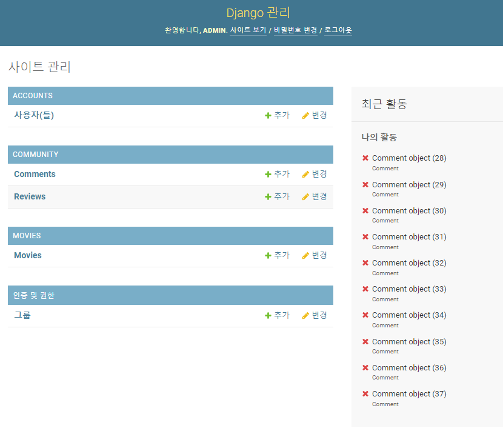
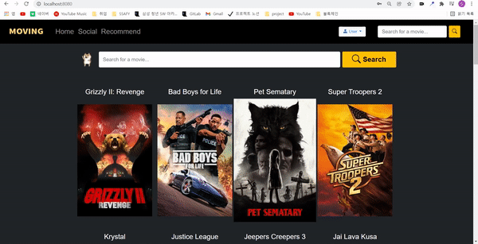
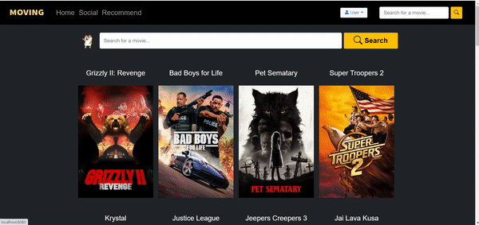

# Readme

속성: 학습한 내용
작성일시: 2021년 11월 25일 오전 11:38

# 최종 프로젝트: 영화 추천 사이트

---

## **Project Period**

2021.11.17 - 2021.11.25

## **Contributors**

- 오제노 (팀장)
- 조해성

## **❗ Requirements**

### **☑️ 개발 환경**

- Python
- Django
- HTML
- CSS
- JavaScript
- Vue.js

### **☑️ 도구**

- VSCode
- Chrome Browser

### **☑️** Architecture

- Django REST API 서버 & Vue.js

### **☑️ 가상환경 생성, 백 패키지 설치**

- final-pjt-back 폴더에서

```bash
$ python -m venv venv
$ source venv/Scripts/activate
$ pip install -r requirements.txt
$ python manage.py migrate
```

### **☑️ 프론트 패키지 설치**

- npm 사용을 위해서 `node.js`와 `Vue Cli`가 설치되어 있는지 확인.
- `final-pjt-front` 폴더 안에서 아래의 명령어를 실행해본다.

`$ node -v`

`$ vue --version`

- 이후 패키지 설치

`$ npm install`

### **☑️ db 생성**

- db는 gitignore로 관리되기 때문에 서버 실행 전에 아래 과정을 실행하여야 한다.
- final-pjt-back 폴더에서

```bash
$ cd movies
$ python save_test.py
$ cd ..
```

### **☑️ .env.local**

> final-pjt-front최상위 폴더에는 .env.local 파일이 작성되어 있으며, 이것은 gitignore로 관리되어 있기 때문에 반드시 해당 파일을 생성하고 프로젝트를 진행하도록 한다.
> 
- `.env.local` 파일에는 다음과 같은 데이터가 저장되어 있다. 해당 파일을 꼭 만들고 서버를 실행해야 한다.
    - `서버 url`
    
      ```
      VUE_APP_SERVER_URL=http://127.0.0.1:8000
      ```
    
      


## **1 .팀원 정보 및 업무 분담**

---

### **팀장 : 오제노**

- tmdb 크롤링, db생성
- accounts 관련 프론트, 백
- community 관련 프론트, 백
- recommend 관련 프론트, 백

### **팀원 : 조해성**

- 전체 모델링
- home화면 관련 프론트, 백
- Movie Search 관련 프론트, 백
- Movie Detail 관련 프론트, 백

## 2. 타임라인 및 업무 기록





## 3**. 기획단계 목표 서비스, 실제 구현 서비스**

---

### 3**.1 기획단계 목표 서비스**

```bash
1. 커뮤니티 - 영화메이트, 시사회
2. 명대사 등록 (댓글처럼)- 조회는 인기순으로(팔로우기능을 만든다면) or 최신
3. OST 등록
4. 평점 기반 추천 알고리즘, 기타 추천 알고리즘
```

### 3**.2 실제 구현 서비스**

```bash
1. 커뮤니티 - 영화 리뷰등록, 리뷰에 댓글작성
2. 장르별 추천영화 제공
3. 영화 정보제공, 예고편 제공, 평점기능 제공
```

- 명대사, OST는 api에 기능이 없어 제외했다.
- 1, 4는 작업시간이 모자라 제외했다.

## **Logo**


## "Moving"

<aside>
💡 마음을 움직이게 하는, 감동을 주는...
</aside>

## ERD




## 4. 기능 및 구성

### A. 관리자 뷰



- 관리자 권한의 유저만 영화 등록, 수정, 삭제 권한이 있다.
- 관리자 권한의 유저만 유저 관리를 할 수 있다.

### B. DB

- crawling 폴더의 파이썬 파일들로 크롤링 및 전처리 작업을 진행했다.
    - argparse를 사용하여 cmd에 get_movies를 10개 실행했었다.
    - tmdb는 api제한이 없다고 들었으나 서버문제인지 클라이언트 문제인지 아무 이유 없이 파일이 멈춰버리는 경우가 많아 몇 번 다른 cmd에서 크롤러를 재실행 해줬다.
    - 유튜브 링크나 디테일, 크레딧 중 하나라도 정보가 없으면 걸러냈다.
    - 다른 api요청에서 받아온 정보들을 재가공하여 하나의 데이터프레임에 넣었다.
    - 일정 이상 데이터가 쌓이면 중간중간 csv파일로 저장하였다.
- db에 영화 2,000개 정보 포함
    - 저장한 파일들에서 중복과 빈 행을 제거하고 하나의 파일로 합쳐 최신순으로 2000개의 영화를 db에 넣었다.
        - 처리과정에서 같은 파일을 수정하며 사용하여 빈 행을 제거하는 등의 일부 과정은 코드로 남아있지 않다. 한번만 할 작업이라 파일을 남길 생각을 하지 못했다.

### C. Accounts

- 회원가입
  
    
    
    - 가입하면 팝업 이후 자동 로그인, 메인화면으로 이동
      
    - 비워두거나 공백만 입력되어 있는 채로 가입시도하면 경고
      
    - 백쪽에서 오류나면 경고.
      
        - 유저네임이 이미 존재하거나 비밀번호가 일치하지 않는 경우
        
            
        
        
    
- 로그인
  
    
    
    - 로그인 성공하면 이전페이지로 돌아감
    
    - 비워두거나 공백만 입력되어 있는 채로 로그인 시도하면 경고
    
    - 아이디나 비밀번호를 잘못 입력하거나 존재하지 않는 아이디인 경우 경고
    
      
    
- 로그아웃
  
    
    
    - 로그아웃 성공하면 현재 페이지 다시 로드
    

### D. Home

- 메인 화면 (개봉일 최신순으로 내림차순 정렬)
  
    
    
- Navbar (전체 기능 동작화면)
  
    
    
    - 창 최대화
      
        
        
    - 창 최소화(토글 버튼 및 펼친 화면)
      
        
        
    - Router
      
        
        
    - 영화 검색창 및 미니 검색 창
        - 알파벳 대소문자 구분 없이 검색
          
            
            
        - 검색 속도 최적화를 위해 최소 두글자이상 작성 하도록 알림창 제시
          
            
            
        - 해당 되는 영화 DB에 없을 시
          
            
            
    
- 영화 상세 페이지
    - 전체 동작 화면
      
        
        
    - 영화 평점 시스템
        - 로그인 된 유저만 평점 부여 가능
        - 별 선택으로 평점 수정 가능
        
    - 리뷰 작성
        - Create review 버튼으로 리뷰 작성

### E. Social

- 리뷰 게시판
    - 리뷰목록
      
        
        
        - 로그인 했을 때만 Create review 표시
        - 작성/수정 시간 표시
        - 리뷰가 없으면 There is no review 표시
          
            
            
        
    - 리뷰
        - 작성
            - 영화 디테일 페이지에서 넘어오면 제목 자동입력
              
                
                
            - 내용이 박스 가로 초과하면 줄바꿈, 세로 초과하면 스크롤 생성, 우측 아래 드래그로 창 크기 조절 가능
              
                
                
            - 빈 칸이 있는채로 Complete하면 팝업
              
                
                
            - Cancel 버튼 누르면 이전페이지로
            - 작성 도중 로그아웃하면 로그인 페이지로
                - 다시 로그인하면 작성페이지로 돌아옴. 영화 디테일에서 넘어왔다면 영화제목 남아있음.
            - 작성 완료하면 리뷰 디테일 페이지로 이동
            
        - 조회
          
            
            
            - 생성, 수정시각 표시
            - Modify 누르면 수정페이지로
            - Delete 누르면 삭제 팝업 후 게시판 목록으로 돌아간다.
            - List 누르면 리뷰게시판 목록으로 돌아간다.
            - 로그아웃하면 로그인창으로
                - 다시 로그인하면 상세페이지로 돌아온다.
            - 아래에 댓글 입력창, 댓글목록 표시
            - 작성자 본인인 경우에만 수정, 삭제 표시
              
                
                
            
        - 업데이트
            - Modify 누르면 업데이트 페이지로
              
                
                
                - 게시글 내용물 그대로 수정페이지로.
                - List 누르면 리뷰 게시판으로 돌아간다.
                - 빈 내용이 있거나 공백을 입력하면 팝업경고
                - Cancel 누르면 게시글 상세페이지로 돌아간다. 수정페이지에서 작성한 내용은 반영되지 않는다.
        - 삭제
            - Delete 누르면 게시글이 삭제되었다고 팝업 후 리뷰게시판으로 돌아간다.
    - 댓글
        - 작성
          
            
            
            - 박스 가로 초과하면 자동 줄바꿈, 세로 초과하면 스크롤 생성, 우측아래 드래그로 창 사이즈 조절 가능
            - 제출하면 페이지 새로고침 없이 댓글목록 최상위에 추가됨
            - 빈 창 그대로 제출하거나 공백만 입력하면 팝업
            
            
            
        - 조회
          
            
            
            - 본인이 작성한 댓글에만 수정, 삭제 버튼
            - 업데이트 시간 표시
        
        - 업데이트
          
            
            
            - Modify 누르면 수정창 표시
            - 빈 창이거나 공백만 입력한 채로 Done 하면 작성때와 똑같은 팝업경고
            - Cancel 누르면 버튼 누르기 전으로 돌아가서 원래 댓글 표시
        
        - 삭제
          
            
            
            - Delete버튼 누르면 해당 댓글만 삭제되고 아래 댓글이 위로 올라옴

### F. Recommend

- 로그인하지 않은 유저는 로그인페이지로
- 최초 진입시 랜덤추천
  
    
    
    - 영화카드에 마우스 올리면 이미지 확대
    - 제목 2줄 넘어가면 말줄임표 표시
    - 영화카드 클릭하면 영화 디테일 페이지로 이동
    
- 장르별 추천 기능
    - 상단에 원하는 장르 버튼 선택 시,  장르별 추천 영화 목록 제공
      
        
        

## 소감

- 팀워크
    - 개발 관련 프로젝트 중요 요소, 팀워크
        - 지속적인 소통으로 효율적인 업무 분담
        - 아침, 저녁 회의 및 지속적인 커밋, 피드백
    
- 학습
    - html/css, 부트스트랩 이해도
        - 박스 구조를 만드는 것이 상당히 힘들었다.
        - 부트스트랩-뷰도 익숙하지 않아 MDN을 봐도 모르는 것이 많았다.
    - 뷰, 장고 이해도
        - 컴포넌트 구조도를 작성해보니 굉장히 이상한 형태였다.
            - 뷰에 대한 이해가 부족하다.
        - 시리얼라이저의 작동방식에 대해 모르는 부분이 많았다.
            - 배우지 않은 부분을 배워가며 사용하는 방법을 익히는 시간이었다.

- 향후 계획
    - 계획 및 실행 불가한 부분 , 홈페이지 요소들 개발자도구로 보게 됨
        - 컨셉은 간단하나 구현할 수 있는지는 별개의 문제였다.
            - 간단해보이는 기능도 구현이 굉장히 힘들었다.